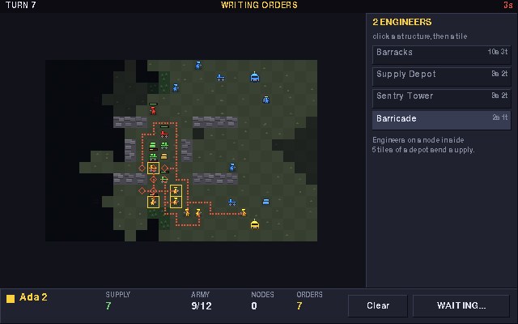
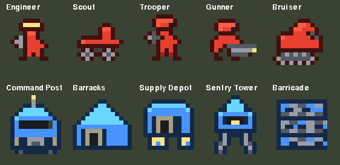

# LAN Arcade

Two lo-fi multiplayer games built to be played across a room: a Windows PC and
a Raspberry Pi 400 on the same LAN, in the same match, at a locked 60 fps on
both.

| | |
| --- | --- |
| **[Scorched](#scorched--artillery)** | Turn-based artillery. Angle, power, wind, and a hillside that stops being a hillside. |
| **[Standing Orders](#standing-orders--skirmish-rts)** | A skirmish RTS where everyone plans in secret and the turn plays out at once. |




One dependency (pygame), one command to start, and a **Find LAN Games** button
so nobody has to read out an IP address.

---

## Table of contents

- [Install](#install)
- [Playing across the LAN](#playing-across-the-lan)
- [Scorched — artillery](#scorched--artillery)
- [Standing Orders — skirmish RTS](#standing-orders--skirmish-rts)
- [How cross-platform play works](#how-cross-platform-play-works)
- [Performance on a Pi 400](#performance-on-a-pi-400)
- [Command line](#command-line)
- [Development](#development)
- [Troubleshooting](#troubleshooting)

---

## Install

Both games need **Python 3.9+** and **pygame 2**. Nothing else — no asset
files, no build step. Sounds are synthesised at start-up and every graphic is
drawn in code.

There is one setup script per platform. Both are safe to re-run — they verify
rather than reinstall — and both finish by actually starting pygame and both
games to prove the install works.

### Windows

Double-click **`scripts\setup.bat`**, then **`scripts\play.bat`** (Scorched)
or **`scripts\play-orders.bat`** (Standing Orders).

`setup.bat` finds your Python (including via the `py` launcher), installs
pygame, and falls back to a virtual environment in `.venv` if a system install
is refused. It also recognises the Microsoft Store placeholder that pretends to
be `python` and tells you to install a real one.

### Raspberry Pi OS, other Linux, macOS

```bash
./scripts/setup.sh
./scripts/play.sh            # Scorched
./scripts/play-orders.sh     # Standing Orders
```

`setup.sh` picks whichever of the three sane approaches suits the machine:

| Situation | What it does |
| --- | --- |
| pygame already installed | Nothing |
| Debian / Raspberry Pi OS | `apt install python3-pygame` |
| Anything else | A virtual environment in `./.venv` |

The apt route matters on a Pi: it is the only option on **32-bit** Raspberry Pi
OS, where no wheel exists, and it sidesteps Bookworm's PEP 668
`externally-managed-environment` refusal entirely. Debian's pygame 2.1.2 is new
enough.

Force a particular approach with `--venv`, `--apt` or `--system`; see
`./scripts/setup.sh --help`.

---

## Playing across the LAN

Identical for both games.

**On the machine hosting:** `Host a Game`, set the rules, add a computer player
or two, `Start Hosting`. The lobby prints the address other players need.

**On every other machine:** `Find LAN Games`, then `Join`.

If discovery is blocked (some managed or guest networks drop UDP broadcast),
use `Connect by Address` and type what the host's lobby showed, e.g.
`192.168.1.40`. A hostname works too: `raspberrypi.local`.

Hosts need **TCP 27015** (Scorched) or **TCP 27019** (Standing Orders) open,
plus **UDP 27016** for the server browser, which both games share — each server
tags itself so the two browsers never list each other's games. On Windows the
first launch pops the usual firewall prompt; allow it on *Private networks*, or
run `scripts\setup.bat --firewall` from an Administrator prompt to open the
ports up front. On Raspberry Pi OS nothing is firewalled by default.

### Dedicated servers

To let a match outlive everyone's client — or to make the Pi host without also
rendering — run it headless. Neither needs a display or pygame at all:

```bash
python3 -m scorched server --bots 2 --rounds 5
python3 -m standing_orders server --bots 2 --map crossroads --teams
```

---

## Scorched — artillery


Two to eight tanks dropped onto a randomly generated landscape. Everyone takes
a turn; last tank standing wins the round. Between rounds you spend your
winnings.

### Controls

| Key | Action |
| --- | --- |
| `←` `→` | Aim the barrel (hold to sweep faster) |
| `↑` `↓` | Power (hold to accelerate) |
| Mouse click | Snap the barrel toward a point |
| Mouse wheel | Fine power adjustment |
| `A` / `D` | Drive left / right — costs fuel, cannot climb cliffs |
| `1`–`9`, `Tab`, `Q` / `E` | Choose a weapon |
| `S` | Raise a shield |
| `Space` / `Enter` | **Fire** |
| `T` | Chat |
| `Esc` | Pause menu |
| `F11` | Fullscreen |

Aim is deliberately *unassisted*: the short dotted line shows the launch
direction only, never where the shell will land. Reading the wind is the game.

---

**Weapons.** Baby Missiles are free and forever. Beyond that: Missiles, Baby
Nukes and Nukes for straightforward destruction; **MIRV** splits into five
warheads at the top of its arc; **Funky Bomb** scatters bomblets; **Leapfrog**
detonates, hops, and detonates again; **Rollers** land and run downhill into
whatever is hiding in the valley; **Diggers** and **Dirt Balls** move earth
without hurting anyone — bury a neighbour, or rebuild the hill you are cowering
behind.

**Defence.** Shields soak damage before your hull does. Parachutes cancel the
fall damage you take when the ground under you leaves. Repair kits patch you up
automatically when you are nearly out.

**The landscape is the other opponent.** Dirt above a crater collapses into it,
so a hit that misses can still drop you thirty pixels onto rock. Six generators
(hills, mountains, valley, plateau, canyon, flat) and six colour schemes mean a
five-round match travels somewhere.

**Bots** play at four skill levels, from *Novice* to *Cyborg*. They are not
cheating: they solve the same ballistic problem you do, fire a simulated tracer,
correct for wind, and then have a deliberate amount of shake added to their
hands. Cyborg has none.

If two dug-in tanks refuse to die, **sudden death** starts collapsing the map
after 55 turns, so a round always ends.


---

## Standing Orders — skirmish RTS


Build times and unit speeds are measured in **turns, not seconds**. Every turn,
all players secretly and simultaneously queue orders for their units and
buildings. When everyone commits (or the clock runs out), the server plays the
whole turn out at once and everybody watches a short replay of what their side
witnessed.

Nobody ever needs faster hands than anybody else. The game is about planning
and reading your opponent, not clicking speed — which is exactly what makes it
work across a wide range of ages at one table.

### Controls

| Input | Action |
| --- | --- |
| Left-click | Select a unit or building |
| Drag | Box-select an army |
| Right-click | **March** there, as fast as the unit goes |
| Shift + right-click | **Advance** there — stops to engage anything it meets, but travels at three-quarter pace |
| `Tab` | Select your whole army |
| `Enter` | Commit your orders |
| `Space` | Skip a replay |
| Hover anything | A tooltip explaining it — terrain, units, buildings, nodes |
| `T` | Chat · `Esc` Pause · `F11` Fullscreen |

Marching and advancing is a real trade-off rather than a strict upgrade:
picking your way forward ready to fight costs you a quarter of your speed, so
crossing your own half of the map is worth doing at a march. Units keep
shooting whatever comes into range either way — the difference is whether they
*stop* for it.

**Orders stand until you change them.** Send a Scout across the map and it keeps
walking, turn after turn; its remaining route is drawn dimmed so you can tell
"already marching" from "about to be told to". A new order replaces the old one
immediately, and `Hold` cancels it.

### The rules

**One resource, Supply**, and getting it needs three things at once: an
**Engineer standing on a resource node**, a **Supply Depot or Command Post
within five tiles** of that node, and that structure finished. The Engineer
transmits to the depot — nothing shuttles, so there is no per-turn busywork —
but every one of those three is something an opponent can take away. Node
ownership itself is persistent: stand on one once and it stays yours.

**Five units.** Three form a rock-paper-scissors triangle, one is an honest
generalist, and one builds things:

| Unit | Cost | Build | Speed | HP | Attack | Range | Beats |
| --- | --- | --- | --- | --- | --- | --- | --- |
| Engineer | 3 | 1 turn | 2 | 10 | 1 | 1 | — (builds and harvests) |
| Scout | 3 | 1 turn | 3 | 12 | 2 | 1 | Gunner |
| Trooper | 5 | 2 turns | 2 | 24 | 4 | 1 | — |
| Gunner | 7 | 2 turns | 2 | 15 | 5 | 2 | Bruiser |
| Bruiser | 9 | 3 turns | 1 | 48 | 6 | 1 | Scout |

Countering gives ×1.5 damage out and ×0.5 back. Gunners and Bruisers need a
**Barracks**, so rushing one is a real opening decision.

**Five structures**, all raised by an Engineer who has to walk there — there is
no build radius, so forward depots and cheeky proxy towers are both on the
table. Any Engineer can finish a site somebody else started; one left with
nobody working it is outlined in red and marked with a `!`:

| Structure | Cost | Build | HP | What it does |
| --- | --- | --- | --- | --- |
| Command Post | — | — | 90 | Trains Engineers, Scouts, Troopers. Researches. Lose it and you are out |
| Supply Depot | 8 | 2 turns | 50 | **+4 army cap**, and receives supply from five tiles away |
| Barracks | 10 | 3 turns | 60 | Unlocks Gunners and Bruisers |
| Sentry Tower | 8 | 2 turns | 40 | Shoots three tiles. Never moves |
| Field Hospital | 10 | 2 turns | 35 | Heals units holding beside it |
| Airfield | 14 | 3 turns | 45 | Calls one airstrike a turn |
| Barricade | 2 | 1 turn | 30 | Blocks the way |

**The army cap starts at 12 and grows by 4 per Supply Depot, to 40.** Engineers
count against it, so every worker is one fewer soldier — that tension is what
makes the economy a decision rather than free money. And because depots raise
the ceiling, an economy buys you a *bigger army*, not merely a faster-rebuilt
one. Some cap is essential either way: without one, two even sides reinforce
exactly as fast as they die and the match never ends.

The ceiling sat at 24 until it was measured. It turned out not to be what ends
a match — length and win rates came out identical at 24, 32, 40 and 64 — it was
just where a late game stopped having decisions in it, with both sides fielding
the same maximum army and a thousand supply banked and nowhere to put it. What
still argues for a ceiling is the clock: turn resolution grows with the units on
the board, and 40 a side is about where a Pi 400 resolves a turn without a
visible pause.

**Barricades** are answered by Bruisers and Engineers, who tear one down in
about two turns. Everything else does quarter damage — roughly ten turns — so a
wall is never an absolute full stop, but bringing a rifle to a wall is
obviously the wrong answer. Units that meet an obstacle route around it rather
than stopping dead.

**Routing** plans around terrain and structures only — never around other
units. Planning around units looked more intelligent and played far worse: a
soldier ordered past his own firing line would set off on a wide arc around it
to reach a tile two steps away, because the crowd he was routing around had
walked off by the time he got there. Bodies in the way are handled where they
actually are a problem, mid-turn: a unit that finds a tile occupied at the
moment it steps reroutes then, with the board as it really is.

**Promotion.** Any unit that has been in a fight can be promoted — Corporal,
Sergeant, Lieutenant — for 12, then 30, then 60 supply. Each rank is +1 attack,
+4 health and a full heal, and a Lieutenant lends +1 attack to every friendly
unit within two tiles, so an officer is a position on the board rather than a
stat line. Each rank has to be earned again: money alone never makes a veteran.

Promotion is what an economy buys once quantity is capped, and it changes what
combat is *for*. A unit you keep alive compounds; one you throw away does not.

**Field Hospitals** heal 4 health a turn to friendly units holding station
within one tile, at 1 supply a point. Care is opt-in and it costs you the
unit's rifle: a patient does not shoot for the turn, and enemies are under no
such restraint. So a hospital at the front is a liability and one at the rear
costs you the march — which is the decision, and it is why the building needs
no other rule to keep it honest. Marching past your own hospital never disarms
anyone, and a unit healed to full stops being a patient by itself.

**Airstrikes** are called from an Airfield for 30 supply, one per Airfield per
turn, anywhere on the map. The strike lands *halfway through the turn*, so you
are aiming at where you think the enemy will be, not where they are now — the
same guess the rest of the game asks you to make. Full damage on the tile, half
on the ring around it, and it hits everything underneath including your own
troops. It is the answer to a turtle, and to a rear-area hospital you cannot
reach by ground.

One consequence worth knowing: if you bomb ground you cannot see, you will not
be told what you hit. The plane flies; the fog keeps its own counsel.

**Research** happens at the Command Post, one project at a time, and applies to
your whole force permanently: Weapons I/II (+1 attack each), Armour I/II (+4
health each, applied to troops already in the field), Logistics (+2 per working
Engineer) and Engineering (structures finish a turn sooner, Barricades cost 1).
Its real job is to give a healthy economy somewhere to spend once quantity is
capped.

**Fog of war**, shared with your team. Ground you have scouted stays drawn but
dimmed; ground you have never seen is black. Enemies you have seen and lost
track of linger as ghosts at their last known position.

**Win by destroying every enemy Command Post.** There is no turn limit. Losing
your Command Post takes your remaining forces with it.

### Maps

Hand-authored, as plain text — a new map needs a text editor and nothing else:

```
!name Crossroads
!players 4
!teams yes
..1......%%.......2.....
....$..............$....
.....####....####.......
```

`.` open · `#` rock · `~` water · `%` forest (walkable, blocks sight, costs
double) · `$` resource node · `1`-`4` spawns. Team play pairs spawns 1&3
against 2&4, so a team map puts those pairs on opposite sides.

Three ship with the game: **Cross Duel** (1v1), **Crossroads** (tight
four-way), and **Dry Basin** (four-way split by a river). Drop a new `.map`
file in `standing_orders/maps/` and it appears in the lobby.

### Sprites



Units and buildings are pixel art written as **string art in
`standing_orders/client/sprites.py`** — at twelve pixels a side a text grid is
a more convenient tool than an image editor, and it keeps the game free of
asset files:

```python
TROOPER = [
    "....####....",
    "...#2222#...",
    "...#2117#...",
    ...
]
```

Each glyph is a *role* rather than a fixed colour — `1` team colour, `2`
highlight, `#` team-tinted outline, `4` metal, `6` hot accent — so one drawing
serves all eight team colours, and edits show up next run with no build step.
Units mirror to face the way they last moved.

### Bots

Four skill levels, from *Novice* to *Cyborg*. They play **under the same fog as
everyone else** — a cheating bot makes scouting pointless — and differ by
restraint and discipline rather than by information.

Skill covers the whole game, not just fighting. A Novice runs one Engineer, one
production line, never researches and never expands; a Veteran masses an army
before committing, counter-picks its production, comes home when its base is
threatened, and builds forward depots to grow its cap — both the ones that put
a node in range and, once it is capped with money to spare, ones bought purely
for the ceiling. Moderate and above raise a Field Hospital, walk their
casualties back to it and promote whoever has earned it; Veteran and Cyborg
also run an Airfield and call strikes, scoring each target by what is under the
blast with their own troops subtracted. When difficulty varied only in how a
bot *fought*, the economy decided matches instead and every level converged on
a coin flip.

Veteran, Cyborg and Moderate each beat Novice 8 games in 8, in a median of
38–49 turns.

Bots march while crossing open ground and only advance once contact is near,
which matters more than it sounds: reinforcements appear at home, so anything
that slows an attacker across the map quietly hands the game to the defender.

**Known limitation: the tiers above Moderate are not really ordered.** Measured
over eight matches each, Moderate beats both Veteran and Cyborg. The labels are
honest about *behaviour* — a Veteran really does mass a larger army, counter-pick
harder and run a wider economy — but that behaviour is not currently worth more
than Moderate's. Play Moderate if you want the stiffest opponent.

The obvious culprit is caution, and it is not: sweeping the "gather this many
fighters before committing" threshold across every value from 3 to 7 leaves the
result unchanged at 1-6. Whatever is wrong is somewhere else, and finding it is
its own job rather than a number to nudge.

This predates the support systems rather than being caused by them: with
Hospitals, Airfields and promotion switched off entirely, Cyborg still lost to
Moderate 1-4 and Veteran managed only 2-2. What those systems changed is that
the matches now *finish* — the inversion used to be hidden behind a 4-in-8
unresolved rate.

Two bots of the same skill used to grind past 200 turns with 5 matches in 8
never resolving at all. Giving a surplus somewhere to go fixed that as a side
effect: a Veteran mirror now settles in a median of 135 turns, 8 times out of 8.
Mismatched bots settle in 38–96.

---

## How cross-platform play works

An x86-64 Windows box and a 32-bit ARM Pi never have to agree about floating
point, because **they never both simulate anything**.

The server is authoritative. In Scorched, firing runs the entire shot to
completion and produces a frame-stamped **timeline** of events. In Standing
Orders, committing orders resolves the whole turn beat by beat and produces the
same kind of timeline, cut down per player to what their side could see. Either
way the timeline is broadcast and every client simply plays it back.

This buys three things:

- **No desync is possible.** Nothing is computed twice, so nothing can
  disagree. The tests assert that two independent clients replaying the same
  event list reach byte-identical results.
- **Lag never stutters.** Network jitter delays when an animation *starts*, not
  how it runs.
- **The slow machine sets no pace.** Clients report when they have finished
  watching, with a grace period; a Pi that finishes late is covered, and one
  that never answers does not hang the match.

Fog of war falls out almost free: since clients only ever receive a curated
replay, hiding information is a filtering problem rather than a netcode one.

Shared plumbing lives in `lanlib/` — the wire protocol (length-prefixed JSON
over TCP with `TCP_NODELAY`), LAN discovery, the widget kit, and the audio
synthesiser — so the next game starts with all of that already working.

---

## Performance on a Pi 400

Both games render a fixed 640x400 playfield that the display scales up.
Scorched composites sky and terrain into a single surface and repaints only the
columns a shell disturbed. Standing Orders composites the tile map once, since
terrain never changes, and memoises line-of-sight discs so recomputing fog
twelve times a turn barely registers.

Measured worst case is well under a millisecond of Python per frame on a
desktop, and a whole Standing Orders turn resolves in about 18 ms.

If a Pi still feels sluggish, the cost is almost certainly SDL scaling 640x400
up to a 1080p display in software:

```bash
./scripts/play.sh --no-scale
./scripts/play-orders.sh --fullscreen
```

---

## Command line

```
python -m scorched [--name N] [--host] [--connect HOST[:PORT]]
                   [--bots N] [--skill novice|moderate|expert|cyborg]
                   [--fullscreen] [--no-sound] [--no-scale]

python -m scorched server [--port P] [--name N] [--bots N] [--skill S]
                          [--rounds N] [--turn-time S] [--wind N]
                          [--terrain STYLE] [--walls none|rebound|wrap]

python -m standing_orders [--name N] [--host] [--connect HOST[:PORT]]
                          [--bots N] [--skill novice|moderate|veteran|cyborg]
                          [--map NAME] [--teams]
                          [--fullscreen] [--no-sound] [--no-scale]

python -m standing_orders server [--port P] [--name N] [--bots N] [--skill S]
                                 [--map NAME] [--teams] [--order-time S]
```

---

## Development

```bash
./scripts/setup.sh --dev   # or: python3 -m pip install -e ".[dev]"
python3 -m pytest          # 261 tests
python3 -m pyflakes lanlib scorched standing_orders tests
```

The tests run headless against SDL's dummy video and audio drivers, so they
work on a build machine with no display and no sound card.

| Package | Role |
| --- | --- |
| `lanlib/` | Protocol, LAN discovery, widget kit, audio synthesis, shared theme |
| `scorched/` | Artillery: terrain, ballistics, weapons, rules, server, client |
| `standing_orders/` | RTS: grid, units, turn resolver, fog, rules, server, client |

Standing Orders' turn resolver (`standing_orders/resolve.py`) is the piece to
read first: everything else exists to feed it orders or to draw what it
decided.

### Known tuning items

Four-player all-bot free-for-all in Standing Orders is still a slow multi-way
standoff — every bot turtles while the others fight. 1v1 and 2v2 settle in a
median of roughly 32-42 turns. Human players are far more decisive, so this
mostly matters if you want to watch four bots play each other.

---

## Troubleshooting

**"Find LAN Games" shows nothing.** The two machines are probably not on the
same subnet — guest Wi-Fi and some mesh routers isolate clients from each
other. Check both can `ping` the other, then use `Connect by Address`. A
firewall rule on UDP 27016 will also stop it.

**Connection refused.** The host has not pressed `Start Hosting` yet, or the
firewall is blocking TCP 27015 / 27019.

**"Match already in progress."** Joining mid-match is not supported; the host
returns to the lobby after the match, or can press `Play Again`.

**No sound.** Expected on a Pi with HDMI audio not yet configured. Both games
detect this and run silently rather than failing. `--no-sound` skips audio
entirely.

**`error: externally-managed-environment` on Raspberry Pi OS.** That is
Bookworm protecting the system Python. `./scripts/setup.sh` avoids it entirely.

**Typing `python` on Windows opens the Microsoft Store.** That is a
placeholder, not an install. Get the real thing from
[python.org](https://www.python.org/downloads/) and tick *Add python.exe to
PATH*. `scripts\setup.bat` detects this case and says so.

**The window is tiny on a 4K display.** `F11`, or start with `--fullscreen`.

---

## License

MIT — see [LICENSE](LICENSE).

Scorched is an original implementation inspired by Wendell Hicken's *Scorched
Earth* (1991). Standing Orders is an original game in the WEGO
(simultaneous-turn) wargame tradition of *Combat Mission* and *Frozen Synapse*.
Neither shares code or assets with any of them.
