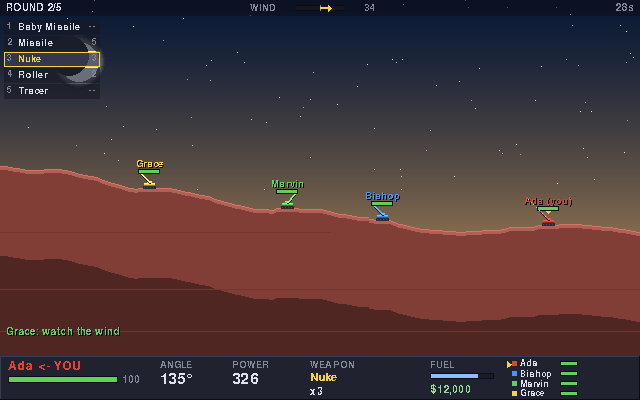
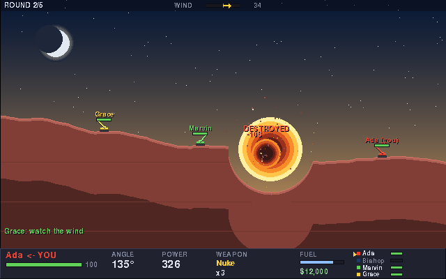
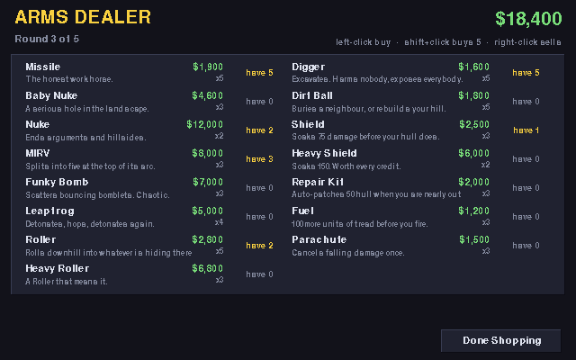

# Scorched

A lo-fi, turn-based artillery game in the spirit of **Scorched Earth** — angle,
power, wind, and a hillside that stops being a hillside. Built to be played
across a room: a Windows PC and a Raspberry Pi 400 on the same LAN, in the same
match, at a locked 60 fps on both.



One dependency (pygame), one command to start, and a **Find LAN Games** button
so nobody has to read out an IP address.

---

## Table of contents

- [Install](#install)
- [Playing across the LAN](#playing-across-the-lan)
- [Controls](#controls)
- [The game](#the-game)
- [How cross-platform play works](#how-cross-platform-play-works)
- [Performance on a Pi 400](#performance-on-a-pi-400)
- [Command line](#command-line)
- [Development](#development)
- [Troubleshooting](#troubleshooting)

---

## Install

Scorched needs **Python 3.9+** and **pygame 2**. Nothing else — no asset files,
no build step. The sounds are synthesised at start-up and the graphics are drawn
in code.

There is one setup script per platform. Both are safe to re-run — they verify
rather than reinstall — and both finish by actually starting pygame and the
game to prove the install works.

### Windows

Double-click **`scripts\setup.bat`**, then **`scripts\play.bat`**.

From a prompt, if you prefer:

```bat
scripts\setup.bat
scripts\play.bat
```

`setup.bat` finds your Python (including via the `py` launcher), installs
pygame, and falls back to a virtual environment in `.venv` if a system install
is refused. It also recognises the Microsoft Store placeholder that pretends to
be `python` and tells you to install a real one.

### Raspberry Pi OS, other Linux, macOS

```bash
./scripts/setup.sh
./scripts/play.sh
```

`setup.sh` picks whichever of the three sane approaches suits the machine:

| Situation | What it does |
| --- | --- |
| pygame already installed | Nothing |
| Debian / Raspberry Pi OS | `apt install python3-pygame` |
| Anything else | A virtual environment in `./.venv` |

The apt route matters on a Pi: it is the only option on **32-bit** Raspberry Pi
OS, where no wheel exists, and it sidesteps Bookworm's PEP 668
`externally-managed-environment` refusal entirely. Debian's pygame 2.1.2 is new
enough.

Force a particular approach with `--venv`, `--apt` or `--system`; see
`./scripts/setup.sh --help`.

### By hand

The only dependency is pygame, so this is enough anywhere:

```bash
python3 -m pip install pygame-ce      # or: sudo apt install python3-pygame
python3 -m scorched
```

---

## Playing across the LAN

**On the machine hosting:**

1. `Host a Game`
2. Set the rules, add a computer player or two, `Start Hosting`
3. The lobby prints the address other players need. Press `Ready`, then `START`.

**On every other machine:**

1. `Find LAN Games` — the host appears within a second or two
2. `Join`

If discovery is blocked (some managed or guest networks drop UDP broadcast),
use `Connect by Address` and type what the host's lobby screen showed, e.g.
`192.168.1.40`. A hostname works too: `raspberrypi.local`.

The host needs **TCP port 27015** open, plus **UDP 27016** for the server
browser. On Windows the first launch pops the usual firewall prompt — allow it
on *Private networks*. To open the ports up front instead, run
`scripts\setup.bat --firewall` from an Administrator prompt. On Raspberry Pi OS
nothing is firewalled by default.

### Dedicated server

To let the match outlive everyone's client — or to make the Pi host without
also rendering — run it headless. This needs no display and no pygame at all:

```bash
python3 -m scorched server --bots 2 --rounds 5
```

Players then join it exactly as above.

---

## Controls

| Key | Action |
| --- | --- |
| `←` `→` | Aim the barrel (hold to sweep faster) |
| `↑` `↓` | Power (hold to accelerate) |
| Mouse click | Snap the barrel toward a point |
| Mouse wheel | Fine power adjustment |
| `A` / `D` | Drive left / right — costs fuel, cannot climb cliffs |
| `1`–`9`, `Tab`, `Q` / `E` | Choose a weapon |
| `S` | Raise a shield |
| `Space` / `Enter` | **Fire** |
| `T` | Chat |
| `Esc` | Pause menu |
| `F11` | Fullscreen |

Aim is deliberately *unassisted*: the short dotted line shows the launch
direction only, never where the shell will land. Reading the wind is the game.

---

## The game



Two to eight tanks, dropped onto a randomly generated landscape. Everyone takes
a turn; last tank standing wins the round. Between rounds you spend your
winnings.

**Weapons.** Baby Missiles are free and forever. Beyond that: Missiles, Baby
Nukes and Nukes for straightforward destruction; **MIRV** splits into five
warheads at the top of its arc; **Funky Bomb** scatters bomblets; **Leapfrog**
detonates, hops, and detonates again; **Rollers** land and run downhill into
whatever is hiding in the valley; **Diggers** and **Dirt Balls** move earth
without hurting anyone — bury a neighbour, or rebuild the hill you are cowering
behind.

**Defence.** Shields soak damage before your hull does. Parachutes cancel the
fall damage you take when the ground under you leaves. Repair kits patch you up
automatically when you are nearly out.

**The landscape is the other opponent.** Dirt above a crater collapses into it,
so a hit that misses can still drop you thirty pixels onto rock. Six generators
(hills, mountains, valley, plateau, canyon, flat) and six colour schemes mean a
five-round match travels somewhere.

**Bots** play at four skill levels, from *Novice* to *Cyborg*. They are not
cheating: they solve the same ballistic problem you do, fire a simulated tracer,
correct for wind, and then have a deliberate amount of shake added to their
hands. Cyborg has none.

If two dug-in tanks refuse to die, **sudden death** starts collapsing the map
after 55 turns, so a round always ends.



---

## How cross-platform play works

An x86-64 Windows box and a 32-bit ARM Pi do not have to agree about floating
point here, because **they never both simulate anything**.

The server is authoritative. When you fire, it runs the entire shot to
completion immediately and produces a **timeline**: a list of events, each
stamped with the animation frame it happens on — trajectory points, explosions,
terrain edits, damage, deaths. That timeline is broadcast, and every client just
plays it back.

This buys three things:

- **No desync is possible.** Nothing is computed twice, so nothing can disagree.
  The test suite asserts that two independent clients replaying the same event
  list end up with byte-identical terrain.
- **Lag never stutters.** Network jitter delays when the animation *starts*, not
  how it runs. A 200 ms hiccup mid-flight is invisible.
- **The slow machine sets no pace.** The server waits for clients to report the
  animation finished, with a grace period; a Pi that finishes late is covered,
  and a Pi that never answers does not hang the match.

Terrain itself is a column heightmap edited with **integer-only** arithmetic, so
replaying the same crater on two platforms cannot drift even in principle.

The wire protocol is length-prefixed JSON over TCP with `TCP_NODELAY`. It is
verbose and completely portable, which is the right trade for a game that sends
a few kilobytes per turn.

---

## Performance on a Pi 400

The playfield is a fixed 640×400 that the display scales up. Two things keep the
frame budget small:

- The sky and the dirt are composited **once** into a single surface. Drawing
  the world costs one opaque blit per frame, not 640 column draws.
- When a shell moves dirt, only the columns it touched are repainted. A Nuke
  dirties about 130 columns out of 640.

Measured worst case (eight tanks, a MIRV in flight, full particle load) is well
under a millisecond of Python per frame on a desktop, leaving roughly an order
of magnitude of headroom for the Pi.

If the Pi still feels sluggish, the cost is almost certainly SDL scaling 640×400
up to a 1080p display in software. Two fixes:

```bash
./scripts/play.sh --no-scale     # plain unscaled window, no stretch at all
./scripts/play.sh --fullscreen
```

---

## Command line

```
python -m scorched [options]

  --name NAME          your callsign
  --host               start hosting immediately
  --connect HOST[:PORT]  join a server immediately
  --bots N             computer players to add when hosting
  --skill LEVEL        novice | moderate | expert | cyborg
  --fullscreen
  --no-sound
  --no-scale           plain 640x400 window (fastest fallback)
```

```
python -m scorched server [options]

  --port PORT          default 27015
  --name NAME          how the game appears in the server browser
  --bots N             --skill LEVEL
  --rounds N           --turn-time SECONDS
  --wind N             maximum wind strength
  --terrain STYLE      hills | mountains | valley | plateau | canyon | flat | random
  --walls MODE         none | rebound | wrap
  --no-announce        stay out of the LAN server browser
```

---

## Development

```bash
./scripts/setup.sh --dev   # or: python3 -m pip install -e ".[dev]"
python3 -m pytest          # 107 tests, ~50s
python3 -m pyflakes scorched tests
```

The tests run headless against SDL's dummy video and audio drivers, so they work
on a build machine with no display and no sound card.

Layout:

| Module | Role |
| --- | --- |
| `scorched/protocol.py` | Framing, sockets, the connection object both ends use |
| `scorched/terrain.py` | Heightmap generation and integer-exact destruction |
| `scorched/physics.py` | Projectile simulation; produces the shot timeline |
| `scorched/weapons.py` | The armoury, as data |
| `scorched/game.py` | Rules: turns, rounds, economy, win conditions |
| `scorched/server.py` | Authoritative server and match loop |
| `scorched/ai.py` | Bot aiming and shopping |
| `scorched/discovery.py` | UDP LAN beacon and scanner |
| `scorched/client/` | Rendering, animation, synthesised audio, front end |

---

## Troubleshooting

**"Find LAN Games" shows nothing.** The two machines are probably not on the
same subnet — guest Wi-Fi networks and some mesh routers isolate clients from
each other. Check that both can `ping` the other, then use `Connect by Address`.
Some Windows setups also drop the global broadcast; the scanner tries per-subnet
broadcasts too, but a firewall rule on UDP 27016 will still stop it.

**Connection refused.** The host has not pressed `Start Hosting` yet, or the
firewall is blocking TCP 27015.

**"Match already in progress."** Joining mid-match is not supported; the host
returns to the lobby after the final round, or can press `Play Again`.

**No sound.** Expected on a Pi with HDMI audio not yet configured. The game
detects this and runs silently rather than failing. `--no-sound` skips audio
entirely.

**`error: externally-managed-environment` on Raspberry Pi OS.** That is
Bookworm protecting the system Python. `./scripts/setup.sh` avoids it entirely —
it uses apt where it can and a virtual environment otherwise.

**Typing `python` on Windows opens the Microsoft Store.** That is a placeholder,
not an install. Get the real thing from
[python.org](https://www.python.org/downloads/) and tick *Add python.exe to
PATH*. `scripts\setup.bat` detects this case and says so.

**The window is tiny on a 4K display.** `F11`, or start with `--fullscreen`.

---

## License

MIT — see [LICENSE](LICENSE).

Scorched is an original implementation inspired by Wendell Hicken's *Scorched
Earth* (1991). It shares no code or assets with it.
